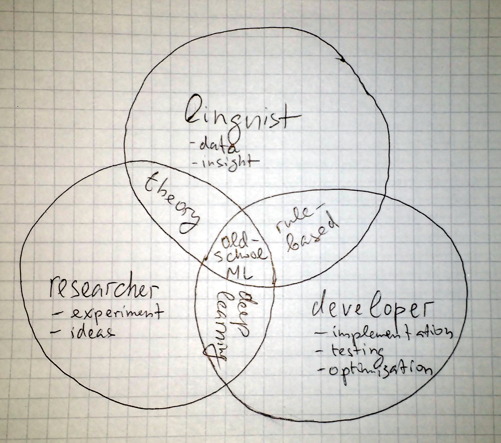
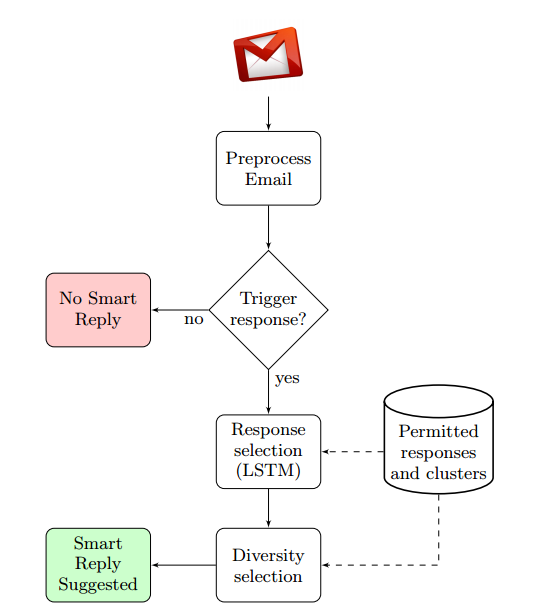
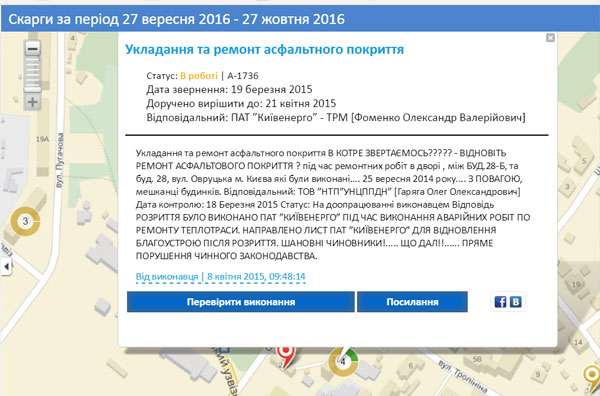

# Interactive NLP in Lisp

## A Bit about Me

Lisp programmer
* Currently work in cognition-related computing (NLP, ML, AI, …)
* 5+ years of NLP work at Grammarly
* Founder of [(m8n)ware](http://m8nware.com)
* Co-founder of [lang-uk](http://lang.org.ua)
* Occasional lecturer
* <https://vseloved.github.io>

## NLP

Transofrming free-form text into data and back

## NLP Problems

* Data analysis
* Prediction
* Generation

* Linguistically-motivated: segmentation, tagging, parsing
* Analytical: classification, sentiment analysis
* Transformation: translation, correction, generation
* Conversation:	question answering, dialog

## Example: Gmail Smart Reply Feature

<http://www.kdd.org/kdd2016/papers/files/Paper_1069.pdf>

Involves:

* Data analysis
* Traditional NLP processing
* FNN
* LSTM
* Semi-supervised graph learning
* Rule-based post-processing
* Engineering

## Data

* (Semi)structured: corpora & dbs
* APIs
* Web-scraping

## 1551.gov.ua Dataset

<https://github.com/lang-uk/1551.gov.ua>

## Progression of Common NLP Approaches

* Pattern matching
* Ngrams
* Random Forest
* Recursive Neural Nets

## Rule-based NLP Systems Examples

* [LanguageTool](http://wiki.languagetool.org/tips-and-tricks)
* [Chatbots](https://stanfy.com/blog/advanced-natural-language-processing-tools-for-bot-makers/)

## Machine Learning

* <http://lisp-univ-etc.blogspot.com/2016/12/5-steps-to-understanding-modern-ml.html>
* ML algorithms [overview](https://docs.google.com/presentation/d/1Wv6r58Kb6L9lKyH9_T8YdQcK7fsXDQZW7gxaCVRNQfY/edit#slide=id.p) and [tour](http://machinelearningmastery.com/a-tour-of-machine-learning-algorithms/)

## Ngrams

1-hot encoding

<http://norvig.com/ngrams/>

## Linear Models

* [Perceptron](http://technion.ac.il/~itamark/ml/2014_winter/09%20-%20perceptron%20proof/cs229-notes6.pdf)
* [Averaged Perceptron](http://lisp-univ-etc.blogspot.com/2014/09/how-to-write-english-pos-tagger-with-cl.html) - a simple, but scalable model - a good starting point
* [Some theory on Linear Models](https://datajobs.com/data-science-repo/Generalized-Linear-Models-%5BAndrew-Ng%5D.pdf)
* [Other features usefule in NLP beyond words](https://drive.google.com/file/d/0B-RlkN4sdg3HX0c4NC1NZmJLeXc/view) 

## Non-linear Models

Hard to apply to general-purpose problems, because of huge feature space. But may be successfully applied to specific tasks. 

Popular model: Random forest.

## Word Vectors

An n-dimensional (usually n=300) dense representation of word derived from word co-occurance information gathered from huge corpus.

<http://clic.cimec.unitn.it/composes/materials/practical-ds-marco-yoav.pdf>

## Recurrent Neural Nets

<http://colah.github.io/posts/2015-08-Understanding-LSTMs/>

## MGL

A Common Lisp [machine learning library](https://github.com/melisgl/mgl), primarily, for building neural networks

by Gábor Melis (http://quotenil.com/)

* Winner of Google AI Contest 2013, Higgs Boson Machine Learning Challenge 2014
* Works at Google Deep Mind

## Appendix: Some Code Usef in the Presentation

See <prj-int-nlp.lisp>
